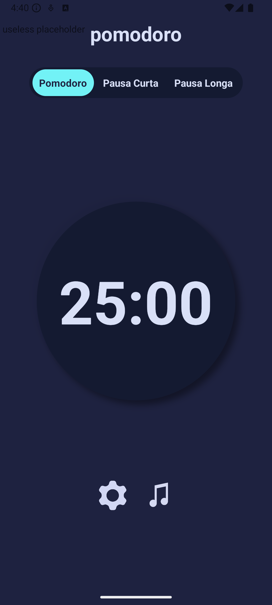
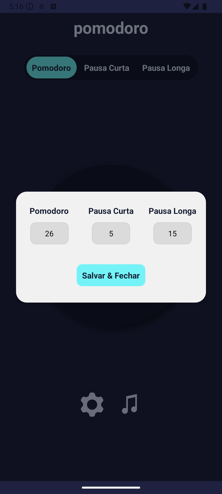

# ⏱️ Pomodoro App

Um aplicativo mobile baseado na técnica Pomodoro, criado para ajudar você a manter o foco e melhorar sua produtividade durante o dia. Com uma interface moderna e intuitiva, você pode personalizar seus tempos de foco e pausa conforme sua rotina.

## 🚀 Funcionalidades

- Alternância entre Pomodoro, Pausa Curta e Pausa Longa
- Personalização dos tempos diretamente no app
- Timer central com visual clean e intuitivo
- Interface responsiva com design agradável

## 🛠️ Tecnologias Utilizadas

- React Native
- JavaScript
- Expo (caso esteja usando)

## 📦 Instalação

Clone o projeto e instale as dependências:

```bash
git clone https://github.com/joaosouza14/Pomodoro
cd pomodoro-app
npm install
npx expo start
```

## 📸 Screenshots

### Tela Principal



### Tela de Configuração



## 🤝 Contribuindo

Contribuições são super bem-vindas! Se quiser sugerir melhorias, corrigir bugs ou propor novas funcionalidades, sinta-se à vontade para abrir uma issue ou pull request.

## 📄 Licença

Este projeto está licenciado sob a licença MIT. Consulte o arquivo [LICENSE](./LICENSE) para mais informações.

---

Feito com 💻 e ☕ por João Souza
